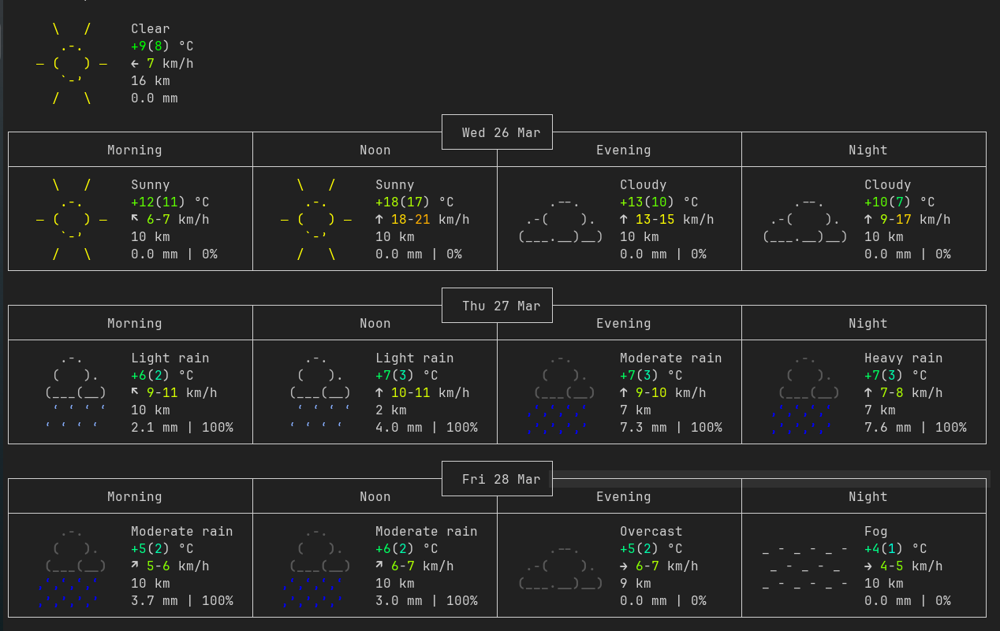

# Weather - Command-Line Weather Application



## About the Project
Weather is a simple command-line (CLI) application that displays weather information. It is written in C and uses weather APIs to fetch data.

## Installation and Usage

### Prerequisites
- Linux operating system (tested on Ubuntu)
- `gcc` for compilation
- `curl` for fetching weather data

### Compilation and Execution
```bash
# Clone the repository
git clone https://github.com/yourusername/weather-cli.git
cd weather-cli

# Compile the program using Makefile
make

# Run the program
./weather
```

## Contributing
If you would like to contribute to this project, please submit a Pull Request or open an Issue.

## License
This project is licensed under the GNU General Public License v3.